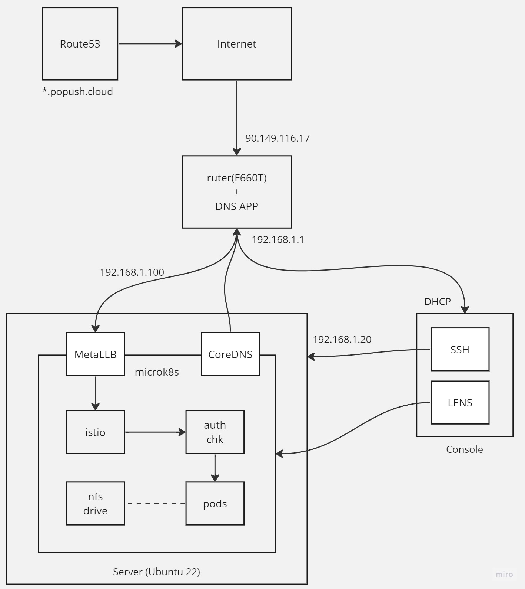
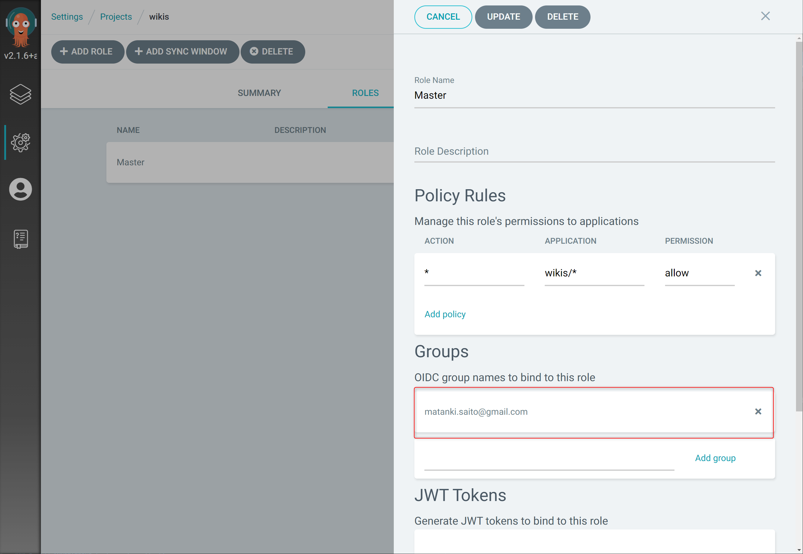

# Localservers



## Set up machine

For instance

- Server machine 192.168.1.20
  - Ubuntu Server: 24.04
  - memory 32GB
  - SSD /dev/sda3 /
  - SSD /dev/sdb1 /home
  - SSD /dev/sdc3 /mnt/oldssd
- Console machine DHCP
  - Windows: 10
  - SSH by Windows terminal
  - [LENS](https://k8slens.dev/)

### root pass
```
$ sudo su -
$ passwd
```

### ufw
```
$ sudo ufw enable
$ sudo ufw default DENY
$ sudo ufw allow from 192.168.1.0/24 to any port ssh
$ sudo ufw allow from 192.168.1.0/24 to any port 16443
$ sudo ufw allows 443
$ sudo ufw allows 80
``` 

Refer to [here](https://qiita.com/shimakaze_soft/items/c3cce2bfb7d584e1fbce)

## Attach one more IP to server machine

```sh
$ sudo apt install net-tools
...
$ ip addr
2: eno1: ...
$ sudo ifconfig eno1:1 192.168.1.100 netmask 255.255.255.0
```

Refer to [here](http://pentan.info/server/linux/nic_sub_ip.html)

## Install microk8s
```sh
$ sudo snap install microk8s --classic
microk8s (1.29/stable) v1.29.4 from Canonical✓ installed
```

## Add args to kubelet
Sets the threshold value to `/var/snap/microk8s/current/args/kubelet`

```
--image-gc-high-threshold=70
--image-gc-low-threshold=50
```

Restart microk8s

```
$ sudo microk8s stop
$ sudo microk8s start
```

## Enable add-on

```sh
$ sudo microk8s enable dns
...
DNS is enabled
$ sudo microk8s enable metallb
Enter each IP: 192.168.1.100-192.168.1.110
...
MetalLB is enabled
```

## Put config to server machine

```sh
$ mkdir ~/.kube
$ sudo microk8s.kubetl config view --raw > ~/.kube/config
...
```

Register kube config in LENS.

## Install helm

```sh
$ sudo snap install helm --classic
...
```

## Prepare namespace

Create namespaces.

- argocd
- monitoring
- backup
- wikis
- ente-pubblico-per-il-benessere-sociale
- cert-manager

```sh
$ sudo microk8s.kubectl create namespace argocd
namespace/argocd created
...
```

Attach the `istio-injection=enabled` label to following namespaces.

- argocd
- monitoring
- wikis
- ente-pubblico-per-il-benessere-sociale

```sh
$ sudo microk8s.kubectl label namespace argocd istio-injection=enabled
namespace/argocd labeled
...
```

## Install argocd by helm

```sh
$ helm repo add argo https://argoproj.github.io/argo-helm
...
$ helm install helm-argocd-release argo/argo-cd -n argocd --set server.extraArgs={--insecure}
...
```

## Install istio

Installation will **fail** if both dns and metallb add-on are not enabled.

```sh
$ curl -L https://istio.io/downloadIstio | sh -
...
$ cd istio-1.22.1/bin/
$ ./istioctl install --set profile=default
This will install the Istio 1.22.1 default profile with ["Istio core" "Istiod" "Ingress gateways"] components into the cluster. Proceed? (y/N) y
✔ Istio core installed
✔ Istiod installed
✔ Ingress gateways installed
✔ Installation complete
```

## Configuring network topologies to use X-Forwraded-For

Ref: https://istio.io/latest/docs/ops/configuration/traffic-management/network-topologies/

1. Create topology.yaml
2. Install topology.yaml using istioctl
3. Restert istiod Deployments by lens

## Change externalTrafficPolicy type from Cruster to Local

1. Open `istio-ingressgateway` service yaml by LENS.
2. Change externalTrafficPolicy type from `Cruster` to `Local`.

## Install istio tools

```sh
$ sudo microk8s.kubectl apply -f https://raw.githubusercontent.com/istio/istio/release-1.22/samples/addons/kiali.yaml
...
$ sudo microk8s.kubectl apply -f https://raw.githubusercontent.com/istio/istio/release-1.22/samples/addons/prometheus.yaml
...
```

## Install cert-manager

```sh
$ helm repo add jetstack https://charts.jetstack.io
...
$ helm repo update
...
$ helm install cert-manager jetstack/cert-manager --namespace cert-manager --version v1.15.0 --create-namespace --set crds.enabled=true
```

## Apply manifests to cluster using argocd

Log in to Argocd. The admin username is `admin`. The admin Password exists in `secrets/argocd-initial-admin-secret`. The ID is `admin`.

Create a Project and create the following Applications in it.

### backup

Backup data to S3.

**Istio blocks communication to MySQL, so sidecar is required for pod. But since sidecar does not exit, cronjob does not exit.With this in mind, the mysql backup job should be deamonset.Then, if you dump immediately after the pod starts, the process fails. You need a 60 second sleep before istio is ready.**

### monitoring

Kibana, grafana etc

**The prometheus yaml fails to reflect because the meta data size is too large. Use "Replace" on argocd to update.**

### wikis

EU4 legacy wiki, CK2 legacy wiki, ck3 mediawiki

### ente-pubblico-per-il-benessere-sociale

rico, henrietta, triela

### gangway

IP block by istio

### rate-limiter

rate limit for eu4 wiki

### argocd

argocd gateway, argocd notifications

## Setup gangway
link: https://istio.io/latest/docs/tasks/security/authorization/authz-custom/

### Edit an istio configmap

Open the "istio" ConfigMap in LENS and add the following a section and save.

```
extensionProviders:
- name: "ext-authz-grpc"
  envoyExtAuthzGrpc:
    service: "external-authz-grpc.local"
    port: "9000"
    includeRequestBodyInCheck:
      maxRequestBytes: 10000000 #10MB
      packAsBytes: true
      allowPartialMessage: true
```

### Create the ServiceEntry

```
apiVersion: networking.istio.io/v1alpha3
kind: ServiceEntry
metadata:
  name: external-authz-grpc-local
  namespace: wikis
spec:
  endpoints:
    - address: gate-sv.gangway.svc.cluster.local
  hosts:
    - external-authz-grpc.local
  ports:
    - name: grpc
      number: 9000
      protocol: GRPC
  resolution: DNS
```

### Create the AuthorizationPolicy
The matchLabels should be the same as the Label for the Service to find Deployment.
Create in the namespace to which you want to apply the rule.

```
apiVersion: security.istio.io/v1beta1
kind: AuthorizationPolicy
metadata:
  name: ext-authz
  namespace: wikis
spec:
  selector:
    matchLabels:
      app: eu4wiki-app
  action: CUSTOM
  provider:
    name: ext-authz-grpc
  rules:
    - to:
        - operation:
            methods:
              - POST
```

### Allow large text submissions
Create following a resource.

```
apiVersion: networking.istio.io/v1alpha3
kind: EnvoyFilter
metadata:
  name: increasebufferlimit
  namespace: istio-system
spec:
  configPatches:
  - applyTo: LISTENER
    patch:
      operation: MERGE
      value:
        per_connection_buffer_limit_bytes: 10000000 #10MB
```

## Setup argocd user(SSO)

Assign a Role to Project. In OIDC group names, enter the Email Address used by your Github account.



Create an [OAuth Application on Github](https://github.com/settings/developers).

Open `configmap/arogocd-cm` with LENS. Set dex.config and url to data section.([ref](https://zenn.dev/kou_pg_0131/articles/argocd-sso-github))

```yml
data:
  dex.config: |
    connectors:
      - type: github
        id: github
        name: GitHub
        config:
          clientID: xxxxxxxxxxxxxxx
          clientSecret: xxxxxxxxxxxxxxxxxxxxxxxxxxxxxxxxxxxxx
  url: https://argocd.popush.cloud
```

Restart the repo, dex, and controller servers on argocd after fixing is complete.

Set `scope` to the data section in `configmap/argocd-rbac-cm`. If the data section is empty, LENS cannot set it.

`kubectl -n argocd patch configmap argocd-rbac-cm -p'{"data":{"scrope":"[email]"}}'`

## Setup argocd notifications

### 1. Install argocd notifications

```sh
$ kubectl apply -n argocd -f https://raw.githubusercontent.com/argoproj-labs/argocd-notifications/release-1.0/manifests/install.yaml
```

### 2. Apply custom catalog

Create app(argocd) from /argocd

### 3. Add ANNOTATIONS to targeet application

Argocd -> target Application -> APP DETAILES -> Edit -> ANNOTATIONS

- key: notifications.argoproj.io/subscribe.on-sync-succeeded.discord
- value : empty
