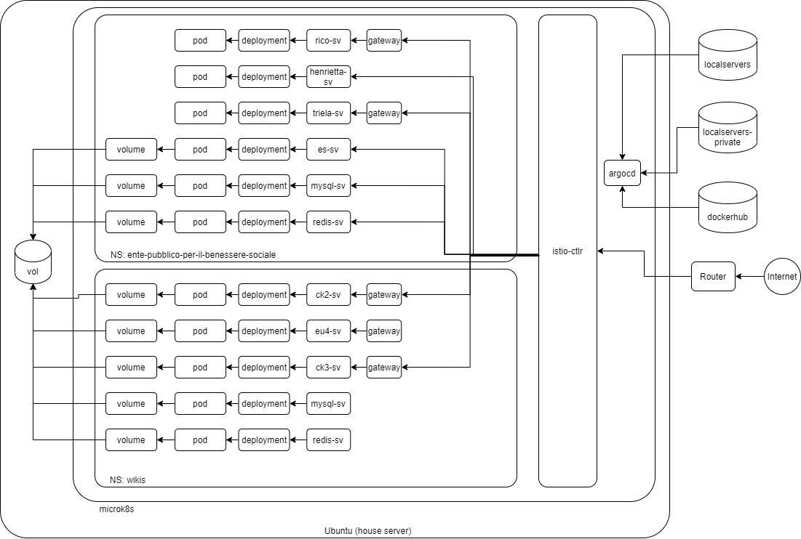

# Localservers



## Set up machine

For instance

- Server machine 192.168.1.20
  - Ubuntu: 20.04
  - memory 16GB
  - `ufw allow 22`
  - `ufw allow 16443`
  - `ufw allows 443`
  - `ufw allows 80`
  - Enable ssh and display sharing
  - [Enable xserver-xorg-video-dummy](http://rarak.jp/16022)
- Console machine 192.168.1.2
  - Windows: 10
  - SSH by Windows terminal
  - [LENS](https://k8slens.dev/)
  - VNC viewer

## Extend swap size and set swap parameters

Refer to [link1](https://qiita.com/gitcho/items/d38b77ce746b5de872f0), [link2](https://www.digitalocean.com/community/tutorials/how-to-add-swap-space-on-ubuntu-20-04-ja)

```sh
$ sudo fallocate -l 4G /swapfile2
$ sudo chmod 600 /swapfile2
$ sudo mkswap /swapfile2
$ sudo swapon /swapfile2
$ swapon -s
$ grep swapfile /etc/fstab 
/swapfile                                none            swap    sw              0       0
/swapfile2                               none            swap    sw              0       0
$ reboot
...
$ swapon --show
$ cat /proc/sys/vm/swappiness
60
$ sudo sysctl vm.swappiness=10
$ cat /proc/sys/vm/vfs_cache_pressure
100
sudo sysctl vm.vfs_cache_pressure=50
```

## Attach one more IP to server machine

```sh
$ sudo apt install net-tools
...
$ ip addr
2: enp2s0: ...
$ sudo ifconfig enp2s0:1 192.168.1.100 netmask 255.255.255.0
```

Refer to [here](http://pentan.info/server/linux/nic_sub_ip.html)

## Install microk8s

```sh
$ sudo snap install microk8s --classic
microk8s (1.20/stable) v1.20.2 from Canonical✓ installed
```

## Enable add-on

```sh
$ microk8s enable dns
...
DNS is enabled
$ microk8s enable metallb
Enter each IP: 192.168.1.100-192.168.1.110
...
MetalLB is enabled
```

## Put config to server machine

```sh
$ microk8s.kubetl config view --raw > ~/.kube/config
...
```

## Install helm

```sh
$ sudo snap install helm --classic
...
```

## Prepare namespace

Create namespaces.

- argocd
- monitoring
- backup
- wikis
- ente-pubblico-per-il-benessere-sociale
- cert-manager

```sh
$ microk8s.kubectl create namespace argocd
namespace/argocd created
...
```

Attach the `istio-injection=enabled` label to following namespaces.

- argocd
- monitoring
- wikis
- ente-pubblico-per-il-benessere-sociale

```sh
$ microk8s.kubectl label namespace argocd istio-injection=enabled
namespace/argocd labeled
...
```

## Install argocd by helm

```sh
$ helm repo add argo https://argoproj.github.io/argo-helm
...
$ helm install helm-argocd-release argo/argo-cd -n argocd --set server.extraArgs={--insecure}
...
```

## Install istio

Installation will **fail** if both dns and metallb add-on are not enabled.

```sh
$ curl -L https://istio.io/downloadIstio | sh -
...
$ cd istio-x.x.x/bin/
$ ./istioctl install --set profile=default
This will install the Istio 1.9.1 default profile with ["Istio core" "Istiod" "Ingress gateways"] components into the cluster. Proceed? (y/N) y
✔ Istio core installed
✔ Istiod installed
✔ Ingress gateways installed
✔ Installation complete
```

## Configuring network topologies to use X-Forwraded-For

Ref: https://istio.io/latest/docs/ops/configuration/traffic-management/network-topologies/

1. Create topology.yaml
2. Install topology.yaml using istioctl
3. Restert istio Deployments

## Change externalTrafficPolicy type from Cruster to Local

1. Open `istio-ingressgateway` service yaml by LENS.
2. Change externalTrafficPolicy type from `Cruster` to `Local`.

## Install istio tools

```sh
$ kubectl apply -f https://raw.githubusercontent.com/istio/istio/release-1.9/samples/addons/kiali.yaml
...
$ kubectl apply -f https://raw.githubusercontent.com/istio/istio/release-1.9/samples/addons/prometheus.yaml
...
```

## Install cert-manager

```sh
$ helm repo add jetstack https://charts.jetstack.io
...
$ helm repo update
...
$ helm install cert-manager jetstack/cert-manager --namespace cert-manager --version v1.2.0 --create-namespace --set installCRDs=true
```

## Apply manifests to cluster using argocd

Create apps from manifests.

### backup

Backup data to S3.

### monitoring

Kibana, grafana etc

### wikis

EU4 legacy wiki, CK2 legacy wiki, ck3 mediawiki

### ente-pubblico-per-il-benessere-sociale

rico, henrietta, triela

### checkpoint

IP block by istio

### rate-limiter

rate limit for eu4 wiki

### argocd

argocd gateway, argocd notifications

## Setup argocd notifications

### 1. Install argocd notifications

```sh
$ kubectl apply -n argocd -f https://raw.githubusercontent.com/argoproj-labs/argocd-notifications/release-1.0/manifests/install.yaml
```

### 2. Apply custom catalog

Create app(argocd) from /argocd

### 3. Add ANNOTATIONS to targeet application

Argocd -> target Application -> APP DETAILES -> Edit -> ANNOTATIONS

- key: notifications.argoproj.io/subscribe.on-sync-succeeded.discord
- value : empty
